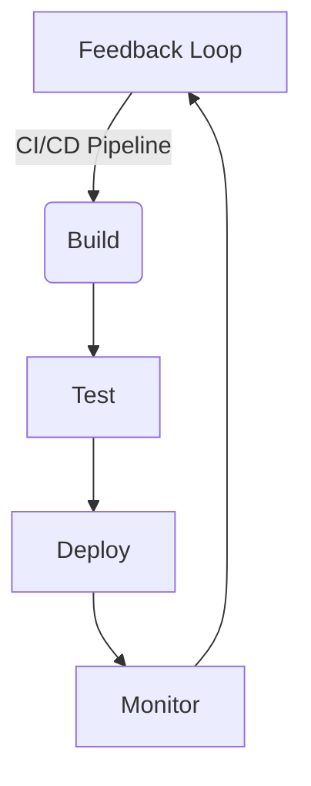

# 👋 Hi, I'm Ruslan

[](https://www.linkedin.com/in/ruslan-lapiniak-3b912b201?originalSubdomain=ua)
[](https://github.com/ruslanlap)

---

## 👨‍💻 About Me

```javascript
const ruslan = {
    role: "Full Stack Developer & DevOps Engineer",
    location: "Ukraine",
    code: ["JavaScript", "Python", "HTML", "CSS", "Shell"],
    technologies: {
        frontEnd: {
            js: ["React", "React.js"],
            css: ["Bootstrap", "GULP", "SASS"],
        },
        backEnd: {
            python: ["Django", "Flask"],
            js: ["Node.js", "Express"],
        },
        databases: ["MySQL", "PostgreSQL"],
        devOps: {
            cloud: ["GCP", "DigitalOcean"],
            containers: ["Docker", "Kubernetes"],
            CI_CD: ["Jenkins", "GitHub Actions", "GitLab CI"],
            IaC: ["Terraform", "Ansible"],
            monitoring: ["Prometheus", "Grafana", "ELK Stack"]
        },
        tools: ["Git", "Docker", "Linux", "Bash", "VS Code", "Postman"]
    }
};
```

---

## 🛠 Tech Stack

### Frontend


### Backend


### Databases


### Tools & Technologies


---

## 📊 GitHub Stats


---

<div align="center">
👀 Profile Views


--

## 🌐 Connect with Me

- 💼 [LinkedIn](https://www.linkedin.com/in/ruslan-lapiniak-3b912b201?originalSubdomain=ua)
- 📫 Reach me on [Telegram](https://t.me/ruslan_ls)

---

## 🚀 Current Focus

- 🔭 **Current Project**: [....]
- 🌱 **Learning**: [AI & DevSecOps]
- 👯 **Looking to Collaborate**: Open-source projects, Startups, and DevOps automation.

---

## 🎯 Key DevOps Skills

- 🔄 CI/CD Pipeline Development
- 🚀 Infrastructure as Code (IaC)
- 📊 Monitoring & Logging
- 🔒 Security Implementation
- 🌐 Cloud Architecture
- 🛠 Automation & Scripting
- 🔧 System Administration
- 📈 Performance Optimization

---

## 🏗 Infrastructure Projects

```yaml
Projects:
  - name: AWS Infrastructure
    tools: [Terraform, AWS, Docker]
    status: Production
    
  - name: Monitoring Stack
    tools: [Prometheus, Grafana, ELK]
    status: Maintained
    
  - name: CI/CD Pipeline
    tools: [Jenkins, Docker, K8s]
    status: Active Development
```

---

## 📈 DevOps Workflow



---

## 🌱 Current Learning Path

- 📚 **Advanced Kubernetes Patterns**
- 🔒 **Cloud Security & DevSecOps**
- 🤖 **Infrastructure Automation**
- 🎯 **Site Reliability Engineering (SRE)**

---

## 🔧 DevOps Toolbox

```bash
# My favorite commands
$ kubectl get pods
$ docker-compose up
$ ansible-playbook deploy.yml
$ git push origin main
```

---

⭐️ From [Ruslan](https://github.com/ruslanlap)
